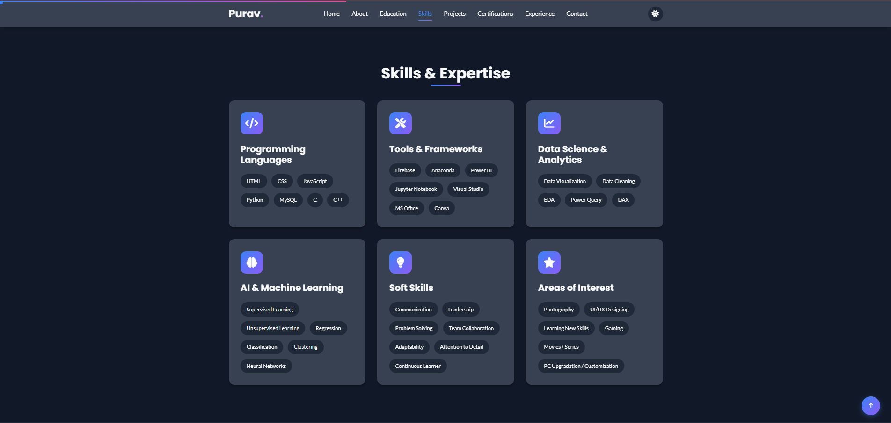
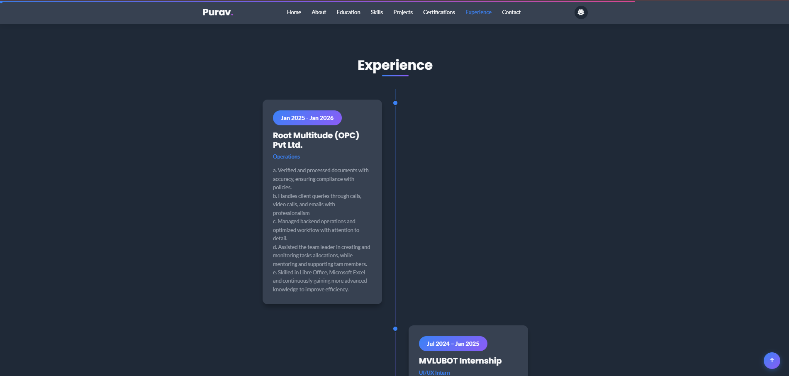
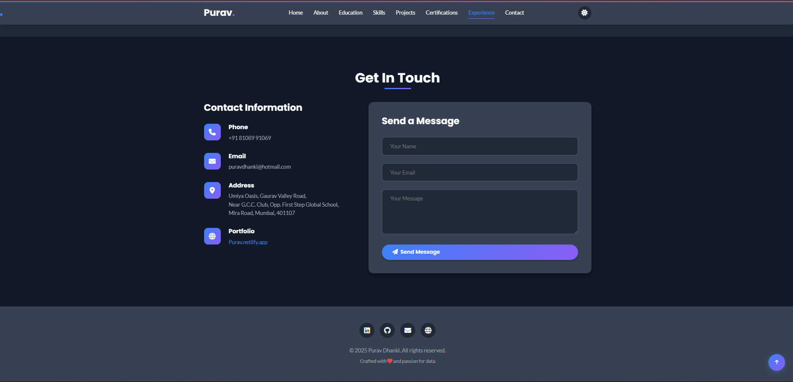

# 🌐 Purav Dhanki – Data Analyst Portfolio

A modern responsive personal portfolio website showcasing my skills, projects, certifications, and experience as an aspiring Data Analyst and B.Sc IT graduate.

---

## 🚀 Live Preview
https://puravdhanki.github.io/Purav-Portfolio/

---

## 📌 Features

✅ Responsive Design  
✅ Light / Dark Mode Toggle  
✅ Smooth Scroll Navigation  
✅ Animated Sections  
✅ Project Showcase  
✅ Resume Download  
✅ Contact Form  
✅ Interactive UI Effects  

---

## 🛠 Tech Stack

- HTML5  
- CSS3  
- JavaScript  
- Font Awesome  
- Google Fonts  

---

## 📂 Project Structure

purav-portfolio/

├── index.html

├── styles.css

├── script.js

├── Purav Dhanki.pdf

└── README.md

---

## 📊 About Me

I am a B.Sc IT graduate and aspiring Data Analyst with hands-on experience in:

- Python  
- SQL  
- Power BI  
- Data Visualization  
- Exploratory Data Analysis  

Currently seeking entry-level Data Analyst opportunities.

---

## 📸 Preview

---

## 📬 Contact

- Email: puravdhanki@hotmail.com  
- GitHub: https://github.com/puravdhanki  
- LinkedIn: https://www.linkedin.com/in/purav-dhanki-b60255241  

---

⭐ If you like this project, give it a star!
